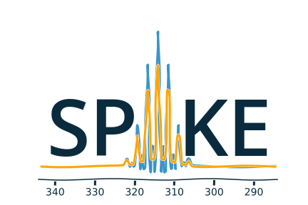

<!-- #region -->
# Developing WITH SPIKE
SPIKE is a tool box, which natural interface is python.
You will find here some advices on using SPIKE.


## data organization


SPIKE mostly defines a dataset `NPKData` structure (usually called `d` in the doc), which is composed of:

 - a large n-dimensional real `numpy` nparray object that contains the actual spectroscopic data
     - modified by all the processing methods, called `buffer` and accessed with the `d.get_buffer()` and `d.set_buffer()` methods
 - one Axis() object per dimension, which contains all the characteristics along the given axis (calibration, data-type, size, etc…)
      - `d.axis1` for a 1D spectrum
      - `d.axis1` and `d.axis2` for a 2D spectrum - with the `d.axes(i)` convenient method
     
 - some attibutes general to the dataset, in particular the `d.params` which contains a copy of the acquisition parameters, structured as a dictionnary
 - a large (and expandable) set of methods that act on the dataset

the same organization is used  regardless we are handling NMR Orbitrap or FTICR Data, however in each case, the Axis() object is just overloaded with the corresponding version for each analytical method

These several kind of NPK dataset are defined in `spike.NMR` `spike.FTICR` and `spike.Orbitrap` which are typically imported in the beginning of a program.

These codes defines the basic objects `NMRData` `FTICRData` `OrbiData` 

The initialisation methods of these object contain several options (creating from a file, a buffer, etc...), check the documentation.

An even easier way of creating a dataset is by importing from a spectroscopic data-format.
The formats handled by the program are defined in the `File` folder, with format from NMR, FTICR and Orbitrap.


## working with the SPIKE dataset
The whole program is organized to spare as much as possible memory space, so that the program is fast, and permits to handle large datasets in-memory.
Because of this, the methods acting on the data (for instance Fourier Transform, or any other modification) actually modifies the data in-place.

Also, all methods attached to the NPK dataset returns the dataset itself, after modification (or no modification, even `.display()` returns the dataset).
This permits a "pipeline" way of processing datasets which is extremely convenient.

so if you want to do:
```python
d = Import_1D(myfile)   # use the specific importer (for instance)
d.hanning()             # apodisation
d.zf(2)                 # zero-filling 
d.rfft()                # real fast Fourier transform
d.modulus()             # take the modulus
d.display()             # show the results
```
you can do as well
```python
d = Import_1D(myfile).hanning().zf(2).rfft().modulus().display()    # as a pipeline
```
if you are just interested in the picture, you don't even have to store the result

Another very typical usage is to Import the dataset and just test some feature without modifying it. 
For this, the `.copy()` which duplicates the whole objet, comes very handy:
```python
d = Import_1D(myfile)       # use the specific importer to load the dataset
d.copy().hamming().rfft().display()     # and use copy() in the pipeline to look at it without modifying d
```
This construct uses a minimal amount of memory, and does not clutter your variable space.

<!-- #endregion -->

<!-- #region -->
## Axis object
Along with the data held in the dataset, there is an `Axis` object for each dimension of the dataset.
They hold all the metadata needed to characterize the unit in which the data are presented.
They are typed, and all heritate from the basic `Axis()` object and there are several types:

- `NMRAxis` to handle NMR experiments, knows unit second(s) Hertz(h) and ppm(p)
- `FTMSAxis` to handle FTMS experiments, knows unit second(s) Hertz(h) and m/z(mz)
- `FTICRAxis` to handle FTICR experiments
- `OrbiAxis` to handle Orbitrap experiments
- `TimeAxis` to handle time evolution (for instance for LC-MS or LC-NMR) knows msec(ms), sec(s), min(m), and hours(h)
- `LaplaceAxis` to handle Laplace transform, (for instance DOSY), knows damping(d)

all axes also know about index(i) which is the position in the buffer and about current(c) which is the currently selected unit with the `.set_unit()` method, or with the `.currentunit` attribute

The axes permit to convert from one unit system to another freely and back, with methods called `.ytox(val)` which computes the value of `val` from unit `y` into unit `x` , and `.xtoy()` which performs the opposite. 
All these methods use the internal calibration defined by appropriate attributes.

For instance in NMR:
```python
d.axis1.ptoi(5.5)   # returns the index at which the 5.5 ppm value is located
d.axis2.itoh(1234)  # returns the frequency at index 1234 along F2 for a 2D
d.axis1.htop(1000)  # returns the ppm value located at 1000 Hz
```
or in FTMS (FTICR as well as Orbitrap)
```python
d.axis1.mztoi(138.85)   # returns the index at which the m/z 138.85 is located
d.axis2.itos(1234)      # returns the t1 time of the transient at index 1234 along F2 for a 2D
d.axis1.htomz(1000)     # returns the mz value located at 1000 Hz
```
These are just a few examples.

Note that the `i` (index) unit does not have to be integer. So if you want to access the buffer at this value, you have to do `int(d.axis1.ptoi(5.5))` or even better `int(round(d.axis1.ptoi(5.5)))` 

In FTICR, the `ML1` `ML2` `ML3` parameters in Bruker are imported as `CalibA`, `CalibB`, `CalibC` attribute of a FTICR `Axis()` (with the caveat that Spike uses a homogeneous convention, while Bruker inverses `ML2` depending on the fact that `ML3` is 0 or non-null.

<!-- #endregion -->

## Displaying and Saving datasets
**Display** of 1D and 2D experiment is performed with the `.display()` method.
It has many optional parameters.
I copy here the documentation:
```
display(self, scale=1.0, autoscalethresh=3.0, absmax=None, show=False, label=None, new_fig=True, axis=None,
                zoom=None, xlabel="_def_", ylabel="_def_", title=None, figure=None,
                linewidth=1, color=None, mpldic={}, NbMaxVect=None)
       
scale   allows to increase the vertical scale of display,
        in 2D if "auto" will compute a scale so the first level is located at at autoscalethresh sigma
autoscalethresh used for scale="auto"
absmax  overwrite the value for the largest point, which will not be computed 
    display is scaled so that the largest point is first computed (and stored in _absmax),
    and then the value at _bsmax/scale is set full screen 
show    will call plot.show() at the end, allowing every declared display to be shown on-screen
        useless in ipython
label   add a label text to plot
xlabel, ylabel : axes label (default is self.currentunit - use None to remove)
axis    used as axis if present, axis length should match experiment length
        in 2D, should be a pair (xaxis,yaxis)
new_fig will create a new window if set to True (default) (active only is figure==None)
        if new_fig is a dict, it will be passed as is to plt.figure()
figure  if not None, will be used directly to display instead of using its own
        figure is actually a "matplotlib.axes" object, not a "matplotlib.figure"
zoom    is a tuple defining the zoom window (left,right) or   ((F1_limits),(F2_limits))
        defined in the current axis unit (points, ppm, m/z etc ....)
linewidth: linewidth for the plots
mpldic: a dictionnary passed as is to the plot command 
NbMaxVect: if set to a number, will limit the number of displayed vectors to that number by decimating the data (in 1D only so far)

can actually be called without harm, even if no graphic is available, it will just do nothing.
```

**Datasets can be stored** to disk in several formats:
- `save_txt(name) .load_txt(name)` creates a plain text file with no metadata - available only of 1D dataset
- `save_csv(name) .load_csv(name)` creates a csv file with the axis metadata - available only of 1D dataset
- `save(name) .load(name)` creates the historic *Gifa* / NPK compatible file (1D or 2D) with all axes metada (used for NMR) 
- `save_msh5(name)` creates a msh5 (HDF5 format) file for 1D or 2D MS experiment  - load is performed at creation

msh5 and *Gifa* file, can be also loaded with the creator.

<!-- #region -->
## Data-set arithmetics
In addition to a large set of methods, it is possible to do dataset arithmetics:

say you have two datasets called `d1` and `d2` you can do the following operations:
```python
# these commands can be pipelined
d1.mult(2)    # multiplies in place the content of d1
d1.add(-1.2)  # adds in place 1.2 to the content of d1
d1.add(d2)    # adds in place the content of d2 to d1
              # will use the numpy rules for datasets of different dimensions
d1.mult(1+2j) # multiplies in place the content of d1 by the complex number 1+2j
              # note that spikes keep track of the complex state of the dataset,
              # that last command will fail if d1 is real
# these cannot
d3 = 2*d1     # creates a new dataset d3 which content is the double of d1
d3 = d1 - 1   # creates a new dataset d3 which content is d1 - 1
# you can even access single points:
x = d1[123]        # for a 1D
y = d2[123,456]    # for a 2D
d2[654,321] = y    # etc.
```
Fourier transform
```python
# time to frequency  
.fft() .rfft() .fftr()    # complex to complex / real to complex / complex to real
# frequency to time inverse Fourier transform
.ifft() .irfft() .ifftr() # and their inverse
```
The real/complex state of the dataset is maintained by spike, and should not changed.
In 2D, the FT methods ask for the axis on which to act.

Note that `d.ifftr().phase(90,0).fftr()` performs the Hilbert transform of d

And many other things - check the documentation.


## Low level access to the data
Besides the arithmetic, the  main buffer is accessible through the `.get_buffer()` and `.set_buffer()` methods.
`.get_buffer()` will actually return a plain numpy array typed relative to the axis `.type` so that for a complex data-set, this command returns a complex array, whereas for a real data-set the array is real.

`.get_buffer()` has an optional argument `copy` which is `False` by default. When `False` , only an *Image* of the data is returned, with no memory location being actually copied, so it does not take memory space. 

Because of this mechanism, operations like
```python
    data.set_buffer( 2*data.get_buffer() )
```
is actually performed in-place in the main buffer, and does not use any additional memory space.
However, with data being typed real, doing:
```python
    data.set_buffer( 2j*data.get_buffer() )
```
would create a new buffer, as a `2j` if the complex number $0 +2i$ and the complex numbers thus created take twice the room of the initial data, because of the imaginary part which has to be created.

The main buffer is actually stored in the attribute `.buffer` of an NPKData. Thus `.buffer` is a standard numpy array, so you can actually play with it:
```python
    x = data.buffer[i]
```
If the data are complex along one axis, then buffer is still real, but real and imaginary values are interleaved.
The state real / complex is conserved in the attributes `d.axis1.itype` (0/1)

Using directly `buffer` is strongly discouraged, because the data-set is not checked. This syntax is used in some parts of the internal code for optimization reasons.

    
## Hypercomplex arithmetics
For a 2D experiment, the complex state of the data is handled independently along each axis.
This is conserved in the attributes `d.axis1.itype` and `d.axis2.itype`
Being complex along both axes means that the dataset is actually in hypercomplex mode (check DOI: [10.1016/0022-2364(88)90036-4](https://doi.org/10.1016/0022-2364(88)90036-4) for details).
This permits to apply independent phase corrections along each axes.
<!-- #endregion -->

<!-- #region -->
# Developing for SPIKE
**SPIKE** is an open-source program, this means that external contributions are welcomed.
If you believe your improvement is useful for other people, please submit a `pull request`.


## plugins
If you consider adding some new feature, it is probably a good idea to implement it as a plugin.
The code contains already quite a few plugins, some are quite sophisticated - see `Peaks.py` for instance which implements a 1D and 2D peak picker, as well as a centroid evaluation and a full listing capability.

You can check also `fastclean.py` for a very simple plugin, or `wavelet.py` for a plugin relying on an external library which has to be installed.

## Some Good Practice

- Spike contains many tools, most of the basic function for data interaction are found in the `NPKData.py` master file; utilities are also scattered in the `util` module.
Use them, life will be easier for the other users.
- Please write tests, even for the plugins ! We use standard python `unittest`, so nothing fancy. All the tests are run automatically every night (code is `Tests.py`), so it will detect rapidly all potential problem.

## Organisation of the Code

The main program is `NPKData.py`, which defines NPKData object on which everything is built.

Spectroscopies are defined in the `NMR.py`, `FTICR.py` and `Orbitrap.py` code, which sub class NPKData.

Many programs contain routines tests (in an object unittest) that also serve as an example of use.
The code goes through extensive tests daily, using the `unittest` Python library. However, many tests rely on a set of tests data-sets which is more than 1Go large, and not distributed here.
<!-- #endregion -->

### Main programs :
a small description of the files:

- NPKData.py
  the main library, allows all processing for any kind of experiments (1D, 2D and 3D)
  to be used as a library, in a stand-alone program or in IPython interactive session
- NMR.py
   The NPKData library adapted to NMR processing
- FTMS.py
   an extension of NPKData generic to Orbitrap and FTICR
- FTICR.py
   an extension of FTMS for processing FT-ICR datasets (1D and 2D)
- Orbitrap.py
   an extension of FTMS for processing Orbitrap datasets (1D)

- processing.py
   a stand alone program, written on the top of FTICR.py, allowing the efficient processing
   of FT-ICR 2D datasets, with no limit on the size of the final file
   Produces multi-resolution files
   syntax :   
   
   ```
   python -m spike.processing param_file.mscf
   ```


### Directories
- *Algo*   
   contains algorithms to process data-sets
   (MaxEnt, Laplace, etc...) not everything active !
- *Display*    
   a small utility to choose either for regular Matplotlib display of fake no-effect display (for tests)
- *File*   
   Importers for various file format for spectrometry, as well as the HDF5 SPIKE native format.
- *plugins*   
   Tools automatically plugged in NPK kernel : display utilities, urQRd algorithm and various other tools. 
- *Miscellaneous*    
   "en vrac"
- *util*   
   set of low-level tools used all over in the code
- *v1*    
   a library implementing a partial compatibility with the NPKV_V1 program
- *example of configuration files*    
    - process_eg.mscf
    - test.mscf

- and *various utilities*
    - NPKConfigParser.py    
    	reads .mscf files
    - NPKError.py  
    	generates error msg
    - QC.py  
    	Quality Check
    - Tests.py  
    	runs all tests
    - dev_setup.py
    	rolls a new version
    - version.py   
    	defines version number

### Authors and Licence ###
Current Active authors for SPIKE are:

- Marc-Andr&eacute; Delsuc     `madelsuc -at- unistra.fr`
- Laura Duciel          `laura.duciel -at- casc4de.eu`

Previous authors:

- Christian Rolando     `christian.rolando -at- univ-lille1.fr`
- Lionel Chiron         `Lionel.Chiron -at- casc4de.eu`
- Petar Markov          `petar.markov -at- igbmc.fr`
- Marie-Aude Coutouly . `Marie-Aude.COUTOULY - at- datastorm.fr`

Covered code is provided under this license on an "as is" basis, without warranty of any kind, either expressed or implied, including, without limitation, warranties that the covered code is free of defects. The entire risk as to the quality and performance of the covered code is with you. Should any covered code prove defective in any respect, you (not the initial developer or any other contributor) assume the cost of any necessary servicing, repair or correction.

Downloading code and datasets from this page signifies acceptance of the hereunder License Agreement. The code distributed here is covered under the CeCILL license : http://www.cecill.info/index.en.html
