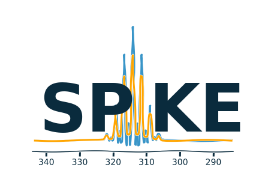

<!-- #region -->
# Spike Notebook documents

The files contained in this directory are intended to provide a simple access to the basic features of `SPIKE`.

They provide a simple User Interface, in the popular Jupyter Notebook format.
Each Notebook provides a single set of functions, for instance 

### 1D NMR
- `Proc1DNMR.ipynb`: The basic NoteBook to process your 1D NMR files, (Bruker only so far)
    - with interactive phasing, baseline correction, peak-picking, Integration
    - Composite display with spectral superimposition, zoom and extracts
    - advanced bucketing capabilities
- `Proc1DNMR_2Dseries.ipynb`: to be used for a set of 1D stored as a pseudo 2D  
    For instance
    - a kinetics experiments
    - $T_1$ or $T_2$ relaxation experiments
    - block acquisition for large NS
    - can be used to pre-process a DOSY experiment, or to isolate heavy components of a DOSY

### 2D NMR
- `Proc2DNMR.ipynb`: to process 2D experiments and display
    - modulus and phased 2D
    - extract rows and columns
- `ProcDOSY.ipynb`: to process and display DOSY experiment using the PALMA algorithm

### FTICR-MS

Processing and display of a 1D FTICR-MS dataset
- `ProcessFTICR-MS.ipynb`: to process FTICR-MS experiment
    - choose the apodisation, the zerofiling level
    - correct the baseline
    - peak-pick and do centroid -
    - superimpose theoretical spectrum
- `ProcessFTICR-MS-PH.ipynb`: same as above but for absorption processing
    - interactive phasing for optimal peak shapes

### 2D FTICR-MS
Processing and Display of a 2D FT-ICR-MS experiments
- `Processing.py` a non interactive program to realise the 2D processing of the dataset
    - able to process up to 500GB-1TB files
    - fully parallel - desktop (multiprocessing)  and HPC (MPI)
    - tested up to 256 processors (MPI)
    - efficient denoising
    - processing of narrowband / NUS / 2XR acquition

You can display and explore the 2DFTICR map:
- zoom in and out,
- change the level of contour
- extract fragment and precursor spectra

There are two tools to display and explore the 2D experiment.
they present the same tools, organized differently.  
- `EasyDisplayFTICR2D.ipynb`: a graphic interface, hiding the python details.
- `DisplayFTICR2D.ipynb`: the same tools have their python interface presented

### utilities
- `ReadSMX.ipynb` Allow to read 1D and 2D processed NMR datasets from Bruker/Topspin
- `Logo.ipynb` the code which generates the Spike logo 

---

This is still an early effort, and the number of *recipes* should grow rapidly - **SPIKE Users are welcome to provide their own !**

The Notebooks can be migrated anywhere, as long as spike is installed and available.
A typical usage is to copy a version close the data to be analysed, and to keep it there, as a lab-book, holding the analysis, and eventually your comments on the data.

## Remarks
**1/**
Note that the notebooks are kept both as ` *.ipynb` (as reference) and as ` *.py` (to follow the difference between commits.) Both version are identical, if they unfortunately do not correspond, the `*.py` should be considered as reference.

**2/** to use this program, you should have installed the following packages:

- a complete scientific python environment ( tested with python 3.9 / [anaconda](https://www.anaconda.com/)  with no support for python 2.7 )
- [`spike`](https://www.bitbucket.org/delsuc/spike) ( *version 0.99.32 minimum* )
- [`ipywidgets`](https://ipywidgets.readthedocs.io/en/latest/)  ( *tested with version 7.6* )
- [`ipympl`](https://github.com/matplotlib/jupyter-matplotlib)  ( *adds interactivity in the notebook* )


<!-- #endregion -->

```python

```
